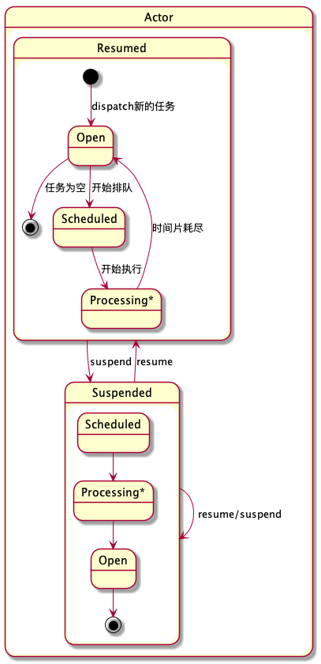

# Actor System的实现

QMQ中实现了一个[Actor处理模型](https://github.com/qunarcorp/qmq/blob/master/qmq-server-common/src/main/java/qunar/tc/qmq/concurrent/ActorSystem.java)，在broker中大量使用了这个机制来处理各种任务。
其设计背景可以参照[消息消费隔离](https://github.com/fankaidev/qmq/blob/master/docs/cn/actor.md)这篇分享，简单来说就是以消费组为单位进行任务划分，保证每个消费组都能够获取到合理的处理资源。这里简单聊聊其实现机制。

虽然名字叫做Actor，不过这里的重点和Erlang/Akka是大不一样了，只是使用每个Actor对应一个mailbox的简单模型，并没有实现用户态线程或者是actor的管理机制。
这里要实现的核心目标只有3个
- 让每个Actor都能获得比较公平的资源分配
- 允许暂停/恢复一个Actor的处理流程
- 能够实现自定义的排序机制，使得某些Actor能够更快的得到响应

当然为了使得Actor维护mailbox能够尽量高效，代码中特地实现了一个精巧的无锁队列，不过这和Actor主流程关系不大，我们就略过不提了(决不能说看不懂~)。

## 主流程
这里Actor的运行机制很简单，底层就是一个java executor线程池。Actor继承了Runnable接口，就是线程池调度的内容。

当然如果直接把Actor丢到线程池里，是无法保证资源隔离的，因为某些Actor可能因为任务比较多而持续的占用资源，会导致那些任务更少的Actor饥饿。
这里解决方案的核心就是在每次调度的时候并不是让Actor处理完所有消息，而是只分配一个时间片，当时间片结束的时候Actor即使还有任务，也需要先停止执行，重新到executor队列中排队。

其实核心的代码非常简单，就是`Actor`类中的`processMessages()`和`run()`两个函数

* `processMessages()`就是每次调度中真正工作的部分，可以看到时间片的实现非常简单，就是根据开始时间和时间片Quota(写死了5ms)来设置一个结束时间deadline。之后在处理完每个消息后都要检查deadline来判断是否需要结束执行。这里的`processor.process()`是用户自定义的执行操作，用于处理单条消息。由于使用了普通的线程池，这里并不保证在执行过程中不会被切换出去；也不保证在deadline到了之后马上能停下来。

```
        void processMessages() {
            long deadline = System.currentTimeMillis() + QUOTA;
            while (true) {
                E message = queue.peek();
                if (message == null) return;
                boolean process = processor.process(message, this);
                if (!process) return;

                queue.pollNode();
                if (System.currentTimeMillis() >= deadline) {
                    return;
                }
            }
        }
```

* Actor实现了Runnable接口，`run()`方法驱动了主要流程。代码中除了调用`processMessages()`外，最核心的操作就是最后两句，即首先更新Actor状态，然后把当前的Actor重新加入到executor的执行队列中，使其下次被调度的时候能够继续执行剩下的任务。
```
        public void run() {
            long start = System.currentTimeMillis();
            String old = Thread.currentThread().getName();
            try {
                Thread.currentThread().setName(systemName + "-" + name);
                if (shouldProcessMessage()) {
                    processMessages();
                }
            } finally {
                long duration = System.currentTimeMillis() - start;
                total += duration;
                QMon.actorProcessTime(name, duration);

                Thread.currentThread().setName(old);
                setAsIdle();
                this.actorSystem.schedule(this, false);
            }
        }
```

## Actor状态转换

Actor的状态转换可能是代码中相对烧脑的地方，还是画个图稍微容易理解一点。



我们可以认为Actor可能处在三种运行状态中，分别是Open/Scheduled/Processing。
* Open是初始状态
* Scheduled状态就是表示Actor已经在executor中排队等待执行
* Processing指的是executor真正执行Actor的过程，也就是上面提到的时间片之内的过程；其实这个状态在代码中没有单独体现，可以认为是Scheduled状态的一部分，但是我觉得单独列出来更易于理解

Actor还有另外一个维度的状态，就是Suspended/Resumed，和上面三种运行状态是正交的。

代码中用了一个int型的status来表示这两个维度的状态，并使用了CAS来处理所有的状态变更。可以看到代码中定义了Open和Scheduled的值，但并没有用一个值来表示Suspended状态，其中奥妙之处下面再说。

```
        private static final int Open = 0;
        private static final int Scheduled = 2;
        private static final int suspendUnit = 4;
```

如上面的状态转换图中所示，Actor在任何的运行状态中都可能会进行suspend/resume的转换。一个Actor被suspend/resume之后其实不会马上影响当前的操作，只是会影响接下来的状态转换。

在正常流程下，Actor首先处在Open状态，调用`dispatch()`或者`schedule()`之后就开始一个循环：如果有需要处理的消息，就到executor中排队执行，状态会依次转换到Scheduled和Processing；在时间片结束后，首先回到Open状态，然后自动进入下一个循环。

如果Actor被suspend，假设当时正处于Scheduled或者Processing的状态，还是会继续执行完当前的循环。等回到Open状态之后，Actor就不会继续执行了，而是直接退出executor的执行队列，只有resume之后才能通过`dispatch()`或者`schedule()`重新开始循环。

我们看看对于状态转换的函数
```
        final boolean setAsScheduled() {
            while (true) {
                int s = currentStatus();
                if ((s & shouldScheduleMask) != Open) return false;
                if (updateStatus(s, s | Scheduled)) return true;
            }
        }
        
        public final boolean resume() {
            while (true) {
                int s = currentStatus();
                int next = s < suspendUnit ? s : s - suspendUnit;
                if (updateStatus(s, next)) return next < suspendUnit;
            }
        }

        public final void suspend() {
            while (true) {
                int s = currentStatus();
                if (updateStatus(s, s + suspendUnit)) return;
            }
        }
```
可以看到`setAsScheduled()`操作是幂等的，且使用了位操作。但是对于`suspend()`和`resume()`操作，则是用了加减操作来处理。第一眼稍觉奇怪，仔细一想就会发现，使用加减操作非常巧妙的支持了Suspend操作的重入。也就是一个Actor可以处理多次的`suspend()`操作，且需要同样次数的`resume()`操作来恢复状态。也因此，Suspended并不需要定义一个独立的状态。

至此，上面所说核心目标中的前两项已经没有问题了。

## Actor优先级

第三个目标就是在*消息消费隔离*这篇文章中提到了Actor优先级的问题，原理不赘述，处理方式就是让那些执行少的Actor拥有更高的优先级。

这里的实现也非常简单，事实上ActorSystem的构造函数中提供了一个`fair`参数。当`fair`为false的时候，executor中的队列就是普通的`LinkedBlockingList`，也就是Actor每次用完自己的时间片后会排到队列的末尾。而当`fair`参数为true的时候，executor会使用`PriorityBlockingQueue`，因此Actor加入到队列之后会进行排序。注意到上面的`run()`函数中会累加每次执行的duration，这正是Actor排序的依据，从而让那些执行时间少的Actor优先得到调度。

## 小结
这基本上就是QMQ中Actor的主要实现内容了，代码很短也很清晰，确实实现的很巧妙，也几乎不依赖任何的其他代码，推荐大家直接读一下。