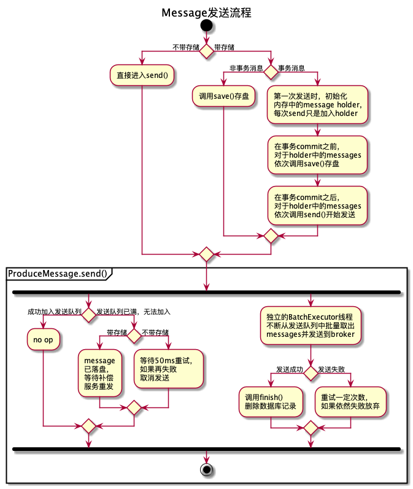

# QMQ Client代码学习笔记

## 发送流程

首先看看[这篇文章](https://www.infoq.cn/article/b4VPvP3m8DA-PM7ZqMGZ)里对于事务消息的设计，核心就是就是把本地操作和要发送的消息保存在同一个事务中来保证一致性。

发消息的流程比较简单，主要的类包括
* MessageProducer
  对外暴露的接口,里边只有两个操作，
  分别是generateMessage()和sendMessage()
* ProduceMessage
  定义了发送message的主要操作，包括
  * send() 开始发送消息（一般是加入到异步发送队列）
  * save() 发送消息前先存储到数据库
  * finish() 发送成功后从数据库删除消息
* TransactionListener
  处理事务消息，在事务过程中会临时存储发送的message，在commit之前
  才真正存储到数据库，保证和其他的本地数据库修改保持原子性。
  commit之后才开始发送message
  
目前发送消息一共有四种可能的场景
* 配置了存储
  * 事务消息(在@Transactional中)
  * 非事务消息
* 没有配置存储
  ** 异步发送
  ** 同步发送

第四种场景同步发送就是不使用BatchExecutor，每次都在用户线程中直接调用rpc，感觉一般不需要使用。  
前面三种场景都使用了BatchExecutor来异步批量发送，文字描述各个场景比较费劲，画了一个活动图来表示。
还有一个环节在这个图里没有画出来，就是需要单独起补偿进程来不断扫描数据库中未发送的消息记录并进行发送。



对于MessageProducer的配置都在BeanConfig里边，可以看到参数就是一个表明身份的appCode，一个metaServer，以及一个用于保证事务的dataSource。目前这里的dataSource是必填的，也就是必须定义存储，可是实际上代码中完全支持不带存储的模式，大概是开源版本中还没有支持好吧。
```
    @Bean
    public MessageProducer producer(@Value("${appCode}") String appCode,
                                    @Value("${metaServer}") String metaServer,
                                    @Autowired DataSource dataSource) {
        SpringTransactionProvider transactionProvider = new SpringTransactionProvider(dataSource);
        final MessageProducerProvider producer = new MessageProducerProvider();
        producer.setAppCode(appCode);
        producer.setMetaServer(metaServer);
        producer.setTransactionProvider(transactionProvider);
        return producer;
    }
```

## 消费流程